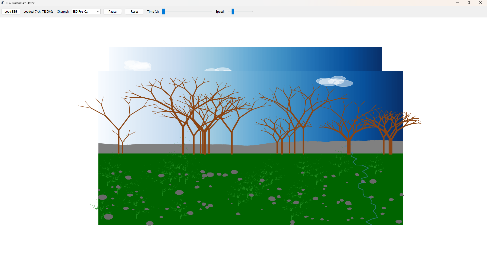

A simple Python application that interprets EEG data as dynamic fractal landscapes. Using MNE for EEG processing
and Matplotlib for visualization in a Tkinter GUI, it maps brainwave frequencies to scene elements: low frequencies
(delta) shape distant mountains, while high frequencies (gamma) add foreground details like ferns and clouds. 
Each playback moment generates a new image based on the EEG window.

# Installation

pip install -r requirements.txt

# Usage

Run the script: python eeg2landscape.py

Load an EDF EEG file via the "Load EEG" button.

Select a channel and press "Play" to start the dynamic landscape generation.

Adjust speed with the slider; reset to clear.

Supports standard EDF files; tested with basic EEG recordings.

# License

Released under the MIT License. See LICENSE for details.
